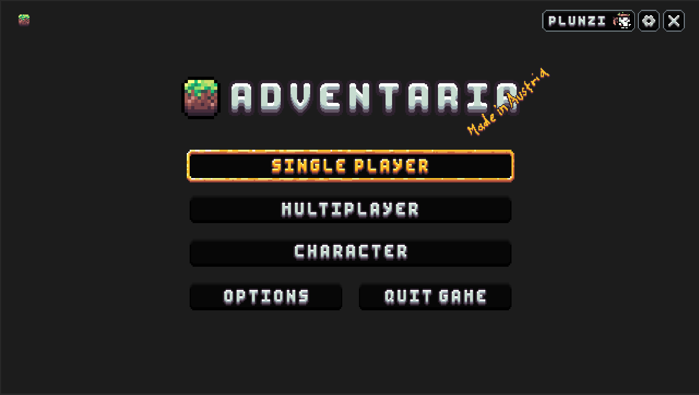

# Adventaria

A 2D cooperative
game inspired by Terraria,
developed in Unity using
Netcode for GameObjects (NGO)
for networking. The project was
designed as a showcase,
accompanied by comprehensive
documentation, to support
teaching materials for lower-year
students.
